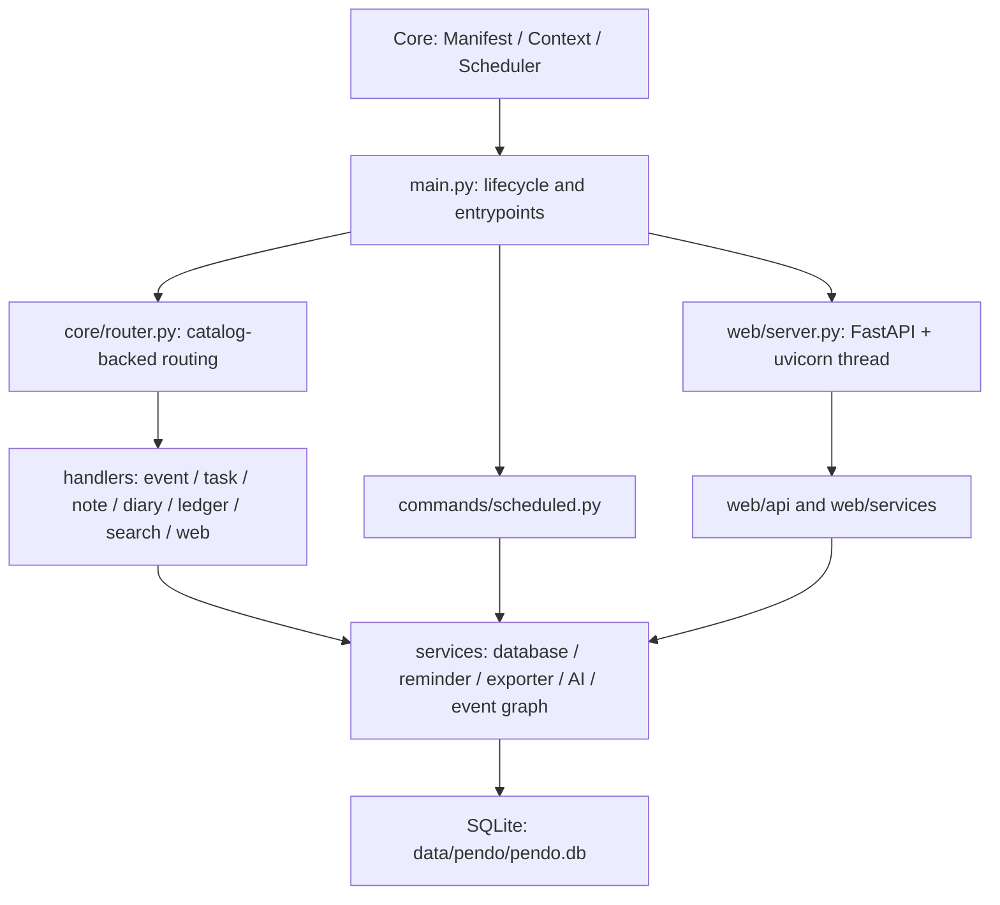
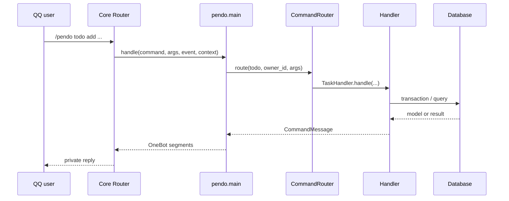

# 🏗️ Pendo 架构

本文面向 Pendo 维护者，说明插件的运行时所有权、命令路由、业务服务、SQLite 存储、调度、Web API 和扩展流程。用户操作见 [README.md](README.md)。

---

## 🏗️ 设计目标

- 聊天端、Web 端和定时任务共享同一业务模型与数据库；
- 每条业务数据按 `owner_id` 隔离；
- 时间戳按 UTC 存储，并按用户 IANA 时区展示；
- 生命周期资源由单一服务获取和释放；
- 外部输入在路由、模型和存储边界逐层校验；
- 发送任务通过持久化 outbox 与确认回执推进；
- Web 身份凭据以摘要形式保存在业务数据库中。

---

## 🏗️ 运行时分层



| 层 | 职责 |
| --- | --- |
| `main.py` | 生命周期、Core 入口、配置订阅、命令与调度适配 |
| `core/` | Pendo 类型、异常、目录驱动路由和上下文状态 |
| `commands/` | 顶层操作、设置、Session 续步和定时业务编排 |
| `handlers/` | 各业务模块的参数解析与用例编排 |
| `models/` | 条目数据类、枚举和序列化模型 |
| `services/` | 存储、提醒、日程图、导出、AI 解析和生命周期资源；`services/runtime.py` 提供 `PendoRuntimeService` |
| `utils/` | 校验、格式化、时区、设置与数据库辅助函数 |
| `web/` | FastAPI 路由、认证、分析、迁移服务和静态 SPA |
| `scripts/` | 显式数据迁移工具 |

---

## 🏗️ 生命周期所有权

`PendoRuntimeService` 是数据库、配置订阅和 Web 服务的内部 service boundary。

### 初始化

1. `main.init()` 从 Core 取得原子配置快照；
2. `PendoConfig.configure()` 校验并发布运行设置；
3. `PendoRuntimeService.open_database()` 解析 `context.data_dir/pendo.db`；
4. `Database` 初始化连接配置与 schema migration；
5. runtime service 取得数据库 singleton 所有权；
6. 配置订阅回调绑定到当前插件代；
7. `web_enabled` 为真时启动 Web 线程。

`context.state["pendo_runtime"]` 保存当前上下文可见的 lifecycle service 与业务服务集合。模块级 runtime service 负责资源所有权，Context 状态负责将所有权发布给入口和回调。

### 配置热重载

配置回调按修订号读取完整快照。新设置校验成功后一次发布。Web 的 `enabled`、`host` 或 `port` 变化会触发有序停止与启动；数据库实例和业务请求继续使用同一代已发布设置。

### 关闭

`main.shutdown()` 按以下顺序收敛资源：

1. 取消配置订阅；
2. 停止 Web 线程；
3. 清理提醒 singleton；
4. 摘除数据库 singleton；
5. 关闭 runtime service 登记的全部 SQLite 连接；
6. 清空当前插件代 Context 状态。

清理步骤会汇总组件级异常，并继续处理其余已拥有资源。

---

## ⌨️ 命令路由

Core 根据 `plugin.json` 识别 `/pendo` 和快捷入口。Pendo 再从 Core `CommandCatalogNode` 构建本地路由表，使帮助、别名、用法与 Manifest 保持同源。



`CommandMessage` 是处理器与入口之间的统一结果结构。`main.py` 负责转换为 Core 消息段，并把异常交给 Pendo 错误映射和公开错误边界。

快捷入口 `/日程`、`/待办`、`/日记` 通过 `TRIGGER_SUBCOMMAND_MAP` 映射到相应规范模块。

---

## 💬 Session 流程

待办、账本和日记等多轮交互使用 Core Session：

1. handler 创建带 `plugin_name=pendo` 的 Session；
2. Session 数据保存操作类型、当前步骤和已收集字段；
3. Core 按用户与聊天作用域串行提交后续消息；
4. `main.handle_session()` 委托 `commands/session.py`；
5. 模块 handler 校验本步输入并更新状态；
6. 完成、退出、超时或状态校验异常时结束 Session。

一行命令与多轮会话最终调用同一模型校验和数据库写入路径。

---

## 🔄 业务处理器

| 处理器 | 主要职责 |
| --- | --- |
| `EventHandler` | 日程、集合、节点、重复规则和提醒管理 |
| `TaskHandler` | 待办 CRUD、状态、计划日期、截止和交互式添加 |
| `NoteHandler` | 笔记、分类、标签、引用和关联条目 |
| `DiaryHandler` | 日记、模板回答、心情、评分和收藏 |
| `LedgerHandler` | 收入、支出、转账、账户、金额分和统计 |
| `SearchHandler` | 跨类型全文检索与结构化筛选 |
| `WebHandler` | Web 生命周期、登录 Code 和 Widget Token |

日程处理器内部按职责分为：

- `event.py`：入口、提醒操作和跨模块编排；
- `event_editing.py`：编辑、删除与集合修改；
- `event_views.py`：列表、详情和展示查询；
- `event_support.py`：共享解析和格式化辅助。

---

## 📌 SQLite 存储

`Database` 组合 `WebAuthRepositoryMixin` 与 `ReminderRepositoryMixin`，集中提供业务 CRUD、搜索、缓存、事务、认证注册表和提醒租约。

### 连接与事务

- 每个工作线程使用独立 SQLite 连接；
- 连接统一启用 WAL、`synchronous=NORMAL`、外键与 busy timeout；
- runtime service 登记连接对象，关闭阶段逐个回收；
- 写操作通过显式事务和数据库锁保持一致性；
- 条目和用户设置包含 `version` 字段，用于乐观并发控制；
- 查询缓存采用 30 秒 TTL、1024 项 LRU，并在相关写入后失效。

### Schema

| 表 | 关系 |
| --- | --- |
| `items` | 全部业务 leaf 与普通条目 |
| `event_collections` | 一对多组织日程 leaf |
| `reminder_logs` | 提醒状态、租约和重试信息 |
| `scheduled_delivery_outbox` | 定时消息与逐目标确认 |
| `operation_logs` | 操作审计和撤销快照 |
| `user_settings` | 每用户设置与版本号 |
| `transfer_logs`、`imported_bundles` | 迁移审计与 Bundle 身份 |
| `login_code_registry` | 一次性 Code 摘要 |
| `web_session_registry` | 浏览器会话摘要与设备信息 |
| `widget_token_registry` | Widget Token ID 与撤销状态 |
| `schema_migrations` | 已应用 migration 记录 |

`services/db_schema.py` 创建基础表，并按版本应用增量列 migration。启动事务会把 schema 变更与版本记录一起提交。

### 时间与金额

完整时刻采用规范 UTC 字符串；`plan_date`、`diary_date` 和 `ledger_date` 使用日期值。API 与命令边界通过 `TimezoneHelper` 转换用户本地时间。

账本以 `amount_cents` 作为整数统计字段。`amount` 保留展示兼容值，导入与迁移会规范化两者。

---

## 📅 日程图

`event_collections` 表示重复日程和多节点日程，`items` 中的 event leaf 通过 `event_collection_id` 关联集合。leaf 还保存角色、索引、节点键和来源条目。

`services/event_graph.py` 负责集合创建、节点一致性、occurrence 操作和跨集合校验。聊天端、Web API、导出与提醒查询均复用这一图模型。

---

## ⏰ 提醒与定时投递

提醒处理分为发现、声明、发送和确认四个阶段：

1. 查询到期提醒；
2. 在 `reminder_logs` 中取得有期限的 claim；
3. 创建或读取 `scheduled_delivery_outbox`；
4. 通过 Core 发送目标逐个投递；
5. 根据回执提交目标状态；
6. 全部目标完成后提交提醒状态并清理 outbox。

claim 记录 token、到期时刻、下一次尝试时刻和失败次数。该模型支持多个调度 tick、进程重启和部分目标重试。

`commands/scheduled.py` 编排每日简报、日记提醒、待办顺延、日志清理、财务周报、财务月报和 Demo 数据回收。Manifest 的 `pendo_prune_operation_logs` 绑定 `scheduled_prune_operation_logs`，每日清理过期操作日志与撤销快照。

---

## 🔐 Web 服务边界

`web/server.py` 在 Bot 进程内运行一个 uvicorn 后台线程。模块状态锁保证当前进程持有一个服务线程，`PendoRuntimeService` 负责其生命周期。Bot 重启、插件重载和 Pendo Web 生命周期保持同步。

FastAPI 应用按以下层次组织：

| 目录 | 职责 |
| --- | --- |
| `web/api/` | 请求模型、认证依赖和 HTTP 路由 |
| `web/analytics/` | Dashboard 与统计查询组合 |
| `web/services/` | Bundle、Demo 空间和迁移用例 |
| `web/static/` | 原生 JavaScript SPA |
| `web/deps.py` | 数据库与会话依赖 |
| `web/auth.py` | Code、Cookie Session 和 Widget JWT |

API 返回统一 `ok`、`message`、`error_code` 结构。安全头包括 CSP、`X-Content-Type-Options` 和 `Referrer-Policy`。局域网或公网监听要求 Secure Cookie 配置，并由 TLS 反向代理提供传输保护。

---

## 🌐 Web 认证流

### 浏览器会话

1. QQ 私聊生成随机登录 Code；
2. 服务端在 `login_code_registry` 保存 Code 摘要和 7 天期限；
3. 浏览器提交 Code；
4. 事务消费 Code 并创建 7 天随机 Session；
5. 浏览器收到 HttpOnly Cookie；
6. 后续请求按 Session 摘要查询 `web_session_registry`；
7. 退出或设备撤销会删除对应注册记录。

### Widget Token

1. QQ 私聊生成 365 天 JWT；
2. JWT 包含 owner、token ID、签发时间、到期时间和 widget scope；
3. `widget_token_registry` 保存 token ID、owner、期限和撤销状态；
4. `/api/widget/*` 同时校验 JWT 签名、scope、期限和注册表状态；
5. 撤销操作更新当前 owner 的有效记录。

两类凭据使用相同的秒级期限计算约定，并拥有独立的认证依赖和权限范围。

---

## 📌 Bundle 迁移

`web/services/transfer_bundle.py` 负责导出版本化 `.pendo.zip`，`bundle_import.py` 负责检查、样例预览和事务执行。导入过程包括：

1. 校验 ZIP 条目、大小、路径和 manifest；
2. 校验文件 SHA-256 与 JSON 结构；
3. 将所有 owner 字段绑定到当前会话用户；
4. 解析引用关系与跨条目 ID；
5. 应用跳过、覆盖或副本策略；
6. 在事务中写入业务表与 Bundle 身份；
7. 记录 `transfer_logs`。

聊天端 `ExporterService` 生成 Markdown 档案，并通过 Core 文件发送能力投递。

`scripts/migration_utils.py` 提供 SQLite 备份、连接、表结构检查、JSON 字段和 UTC 时间规范化能力，三个显式迁移入口共享这些原语。

---

## 🔐 并发边界

- Core 按插件 Manifest 执行 Pendo 命令；
- Core Session 对同一用户与聊天作用域串行提交；
- SQLite 写事务保护跨线程一致性；
- Database 为设置、缓存和连接登记使用独立锁；
- Web server 状态由模块级重入锁保护；
- 调度任务依靠提醒 claim、outbox 和数据库约束协调；
- runtime service 控制数据库、订阅和 Web 的单一所有者。

---

## 🔄 扩展流程

### 新增业务命令

1. 在 `plugin.json` 增加命令目录节点；
2. 在对应 handler 实现参数解析与业务用例；
3. 在 `main.py` 的 handler 映射中注册顶层模块；
4. 复用模型校验、时区和数据库事务；
5. 更新 README 的用户命令；
6. 添加正常、边界、权限、错误和并发测试。

### 新增字段

1. 更新 `models/item.py`；
2. 在 `services/db_schema.py` 增加版本化 migration；
3. 更新数据库序列化与反序列化；
4. 更新命令、Web API、搜索与 Bundle；
5. 增加旧库迁移、往返序列化和并发更新测试。

### 新增 Web 能力

1. 在 `web/api/` 定义严格请求模型与路由；
2. 从 `web/deps.py` 取得数据库和认证会话；
3. 把复合用例放入 `web/services/` 或共享业务 service；
4. 在 `web/static/js/pages/` 增加页面模块；
5. 添加 API、权限、租户隔离和浏览器行为测试。

---

## ✅ 验证

Pendo 回归测试位于 `tests/plugins/pendo/`，覆盖聊天命令、Session、数据库、提醒租约、Web 认证、API、Bundle、Demo、时区和生命周期。

```bash
python -m pytest -q tests/plugins/pendo
python -m ruff check plugins/pendo
python -m mypy plugins/pendo
```
